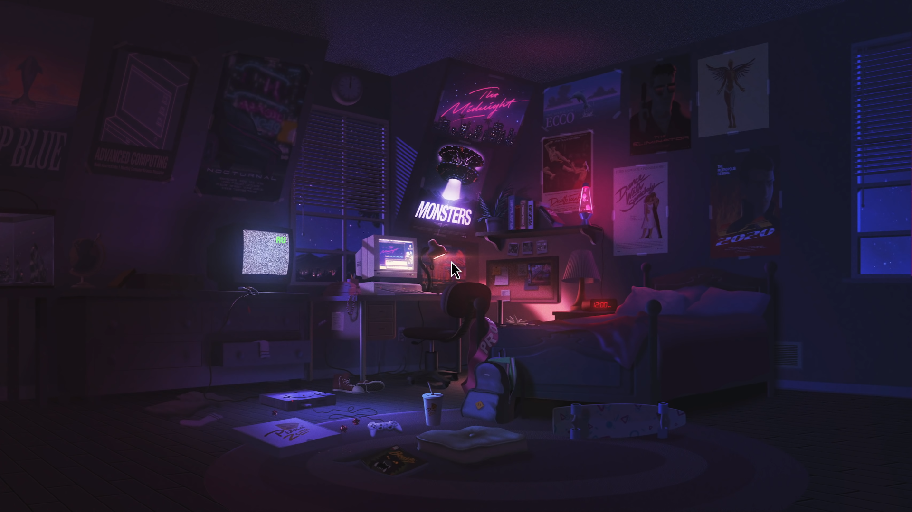
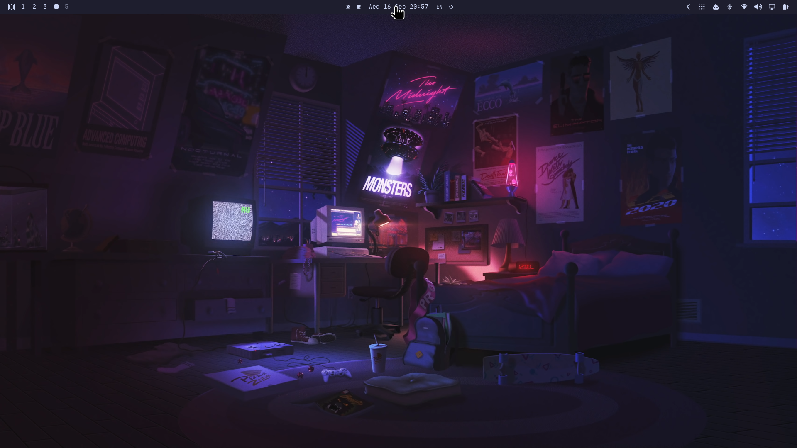

# Omarchy Top Bar Peek

Hide your top bar with the usual Omarchy toggle. Touch the top two pixels of
the screen to slide it back over your windows. Move away and it slides out.

Top Bar Peek runs inside Omarchy's existing Quickshell process and inherits the
installed bar. Your widgets, layout, colors, fonts, transparency, menus and
popouts remain native. Hover never changes the saved hidden preference or
reserves desktop space. A normally visible bar behaves as usual.

## See it in action

[Watch the 19-second demo](media/demo.mp4): edge reveal, movement across the
bar, a calendar popout, and automatic hiding. Recorded on an empty workspace
with Omarchy's screen recorder, at 1080p/60 fps without audio.

| Hidden | Revealed at the top edge |
|---|---|
|  |  |

## Install

Requires Omarchy 4's Quickshell bar. Tested on Omarchy **4.0.4-1**.
There are no extra runtime dependencies. Python 3 is only needed for the live
regression check.

```sh
omarchy plugin add https://github.com/WhiteHades/omarchy-topbar-peek --enable --yes
```

Use **Super + Shift + Space** to toggle the bar. While hidden, hover at the
top edge. The bar stays open over its widgets and while a widget popout is
open. After leaving, it waits 120 ms and slides out over 140 ms using the same
`OutCubic` easing and duration as Omarchy's popup cards.

This behavior applies to top bars only. Other bar positions retain their stock
behavior. Each screen gets its own reveal trigger. The bar appears in the
overlay layer, including above fullscreen applications. Session locking is
still controlled by Omarchy.

Update or return to the stock bar:

```sh
omarchy plugin update io.github.whitehades.topbar-peek --yes
omarchy bar use omarchy.bar
# Optional, after switching back:
omarchy plugin remove io.github.whitehades.topbar-peek --yes
```

## How it works

`Bar.qml` inherits `qs.plugins.bar.Bar`. It finds that bar's native panel
windows and adds a two-pixel Wayland edge trigger plus a passive hover
observer. While hidden, it animates only the top margin and promotes the
window to the overlay layer. The stock bar keeps `ExclusionMode.Ignore`
because its `barHidden` state stays true. No polling process, extra daemon,
copied widget implementation, packaged-file edit, or Hyprland rule is needed.

Installation and selection use Omarchy's official plugin commands. The QML
inheritance and panel discovery use **internal bar implementation details**,
not a promised stable Omarchy API. Changes to those internals may require a
Top Bar Peek update. The plugin is independent of Omarchy and replaces any other
selected full-bar plugin. Third-party widget service access follows Omarchy's
normal restrictions for replacement bars.

Once the pointer enters the bar below the trigger, the trigger releases input,
including its top two pixels. Popouts hold the bar until dismissed so you can
move into them without losing their anchor.

## Verify or develop

```sh
omarchy plugin validate .
python check.py
python check.py --appearance
omarchy shell topbar-peek status
```

Run the check from an active Hyprland session with Top Bar Peek selected and the bar
at the top. It moves the pointer, opens/closes the clock popout, and toggles the
bar; it restores the pointer and hidden preference afterward. It checks edge
reveal, widget hover, overlay placement, unchanged window geometry and monitor
reserved space, popup retention, hide, and normal pinned visibility. It assumes
the stock clock widget is enabled and no popout is already open.

Leave the pointer idle during the check. `--appearance` repeats it with
`omarchy bar transparent true/false` and `omarchy plugin enable/disable
omarchy.background`, then restores both settings. Bar transparency and desktop
wallpaper are independent: all four combinations work.

Live checks on Omarchy 4.0.4-1 covered:

| Scenario | Result |
|---|---|
| Hidden edge reveal, widget hover, exit and rapid re-entry | Passed |
| Clock popout interaction and dismissal | Passed |
| Normal pinned mode and 16 consecutive native toggles | Passed |
| Opaque and transparent bars, with and without desktop wallpaper | Passed |
| Overlay above a fullscreen application, unchanged window geometry | Passed |
| Physical display plus a virtual display at 125% scale | Passed |
| Virtual output hotplug, removal and monitor-origin change | Passed |

After editing an installed checkout, use `omarchy restart shell` if plugin
hot-reload has retained cached QML. Physical monitor unplug/replug and other
hardware/scale combinations have not been verified.

## Existing work

Omarchy's [native bar](https://github.com/omacom/omarchy/blob/quattro/shell/plugins/bar/Bar.qml)
already parks hidden windows off-screen, but does not expose an edge-reveal
setting. Its [plugin system](https://omarchy.org/manual/shell-plugins/) provides
installation and full-bar selection.

[ericvrp's autohide plugin](https://github.com/ericvrp/omarchy-bar-autohide)
provided a useful edge-trigger and hover-observer reference. Its reveal removes
the hidden flag, which restores the native reserved area, and it has no slide
animation. [Bar Control](https://github.com/radyalz/omarchy-bar-control) adds
animated autohide through a full bar copy, but also reserves space when shown.
Top Bar Peek keeps the stock hidden state throughout the overlay reveal.
